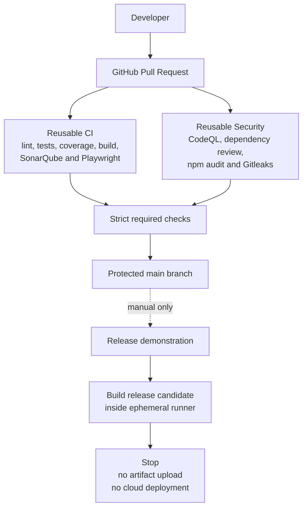

# FlightOps Secure Delivery Factory

[](https://github.com/DDongZheng/flightops-secure-delivery/actions/workflows/release.yml)
[](https://github.com/DDongZheng/flightops-secure-delivery/actions/workflows/reusable-security.yml)
[](https://sonarcloud.io/summary/overall?id=DDongZheng_flightops-secure-delivery)
[](https://sonarcloud.io/summary/overall?id=DDongZheng_flightops-secure-delivery)

A small-scale DevSecOps showcase built around a simulated flight-readiness application.

> [!IMPORTANT]
> This repository is demonstration-only. It does not deploy to AWS or any other cloud platform, does not contact staging or production environments, and does not use real operational data.

The application runs locally. New missions are stored only in browser memory, and refreshing the page restores the original fictional dataset.

## Current operating mode

The active project intentionally stops before deployment:

```text
Source change
  → Pull request
  → Reusable quality checks
  → Reusable security checks
  → Protected main branch
  → Optional manual release-candidate build
  → Stop: no upload, no cloud credentials, no deployment
```

The repository previously demonstrated deployments to AWS Amplify. That integration has been retired to avoid cloud usage and possible charges. Historical pull requests and workflow runs remain available as evidence of the earlier learning exercise, but they do not describe the current operating mode.

## What this project demonstrates

- reusable GitHub Actions workflows;
- protected pull request delivery;
- automated linting, tests, coverage and production builds;
- SonarQube quality analysis;
- CodeQL static application security testing;
- dependency review and `npm audit`;
- secret scanning with Gitleaks;
- Playwright end-to-end testing against a local preview server;
- Dependabot updates for npm and GitHub Actions;
- a manual, build-only release demonstration with no deployment;
- verification without retained GitHub Actions artifacts or dependency caches;
- documented SSDLC controls and historical delivery evidence.

## Architecture



## Pull request pipeline

Every pull request targeting `main` invokes the reusable CI and security workflows.

```text
Pull Request
  → npm ci
  → ESLint
  → Vitest unit and component tests
  → 80% coverage thresholds
  → Production-mode local build
  → SonarQube Quality Gate
  → Playwright against a local preview server
  → CodeQL
  → Dependency Review
  → npm audit
  → Gitleaks
  → Required checks allow merge
```

The application build is called a production build because it uses Vite's optimized build mode. It is not deployed to a production environment.

## Release demonstration

`.github/workflows/release.yml` is a manual showcase workflow. When explicitly started, it:

1. installs dependencies from the committed lockfile;
2. runs lint checks;
3. runs unit and component tests;
4. creates a release-candidate build inside the ephemeral GitHub runner;
5. records that no deployment occurred.

The workflow does not:

- run automatically on pushes to `main`;
- request an OIDC token or cloud credentials;
- reference AWS, Amplify, staging or production;
- push a deployment branch;
- upload or retain a build artifact;
- deploy the application anywhere.

## Security controls

| Area | Current control |
| --- | --- |
| Source governance | Protected `main`, pull requests and strict required checks |
| Code quality | ESLint and SonarQube Quality Gate |
| Automated testing | Vitest, React Testing Library and Playwright |
| Coverage | 80% minimum for statements, branches, functions and lines |
| Static security analysis | CodeQL for JavaScript and TypeScript |
| Dependency security | Dependency Review, `npm audit` and Dependabot |
| Secret detection | Gitleaks |
| Build reproducibility | Committed lockfile and `npm ci` |
| Workflow permissions | Read-only by default; no cloud identity token |
| Release boundary | Build-only demonstration; deployment prohibited |
| Storage boundary | Reports remain in job logs; no workflow artifact upload or dependency cache |

The secure development policy supports practices associated with ISO 27001, but this project does not claim ISO 27001 certification.

## Verified quality results

The last documented complete verification recorded:

| Metric | Result |
| --- | ---: |
| Unit and component test files | 3 passed |
| Unit and component tests | 17 passed |
| CI Playwright tests | 2 passed |
| Statements coverage | 93.65% |
| Branch coverage | 93.10% |
| Functions coverage | 100% |
| Lines coverage | 93.44% |

Historical staging and production results are retained in [Delivery Evidence](DELIVERY_EVIDENCE.md) and are explicitly marked as retired.

## Application features

The Flight Readiness Dashboard allows a user to:

- view simulated flight missions;
- distinguish Draft, Ready and Blocked missions;
- create a new flight mission;
- complete a readiness checklist;
- report a technical issue;
- calculate mission readiness automatically.

Readiness is calculated using these rules:

```text
Mission not submitted
  → DRAFT

Mission submitted with an incomplete checklist
  → BLOCKED

Mission submitted with a technical issue
  → BLOCKED

Mission submitted with all checks completed
  → READY
```

## Documentation

- [Cloud Retirement Checklist](CLOUD_RETIREMENT_CHECKLIST.md)
- [Historical Delivery Evidence](DELIVERY_EVIDENCE.md)
- [Secure Development Policy — English](SECURE_DEVELOPMENT_POLICY.md)
- [Politique de développement sécurisé — Français](SECURE_DEVELOPMENT_POLICY.fr.md)
- [安全开发政策 — 中文](SECURE_DEVELOPMENT_POLICY.zh-CN.md)

## Local development

### Prerequisites

- Node.js 24
- npm

The project declares Node.js `>=24 <25`.

### Install and run

```bash
npm ci
npm run dev
```

### Run quality and test controls

```bash
npm run lint
npm run test
npm run test:coverage
npm run build
npx playwright install chromium
npm run test:e2e
```

### Preview the optimized build locally

```bash
npm run preview
```

## Project structure

```text
.
├── .github/
│   ├── dependabot.yml
│   └── workflows/
│       ├── pull-request.yml
│       ├── release.yml
│       ├── reusable-ci.yml
│       └── reusable-security.yml
├── e2e/
├── src/
├── CLOUD_RETIREMENT_CHECKLIST.md
├── DELIVERY_EVIDENCE.md
├── SECURE_DEVELOPMENT_POLICY.md
├── SECURE_DEVELOPMENT_POLICY.fr.md
├── SECURE_DEVELOPMENT_POLICY.zh-CN.md
├── playwright.config.ts
├── sonar-project.properties
└── vitest.config.ts
```

## Technology stack

- Application: React, TypeScript and Vite
- Testing: Vitest, React Testing Library and Playwright
- Quality: ESLint, V8 coverage and SonarQube Cloud
- Security: CodeQL, Dependency Review, `npm audit`, Dependabot and Gitleaks
- Automation: GitHub Actions and GitHub Rulesets
- Hosting: none

## Cost boundary

The current repository does not require AWS, a hosting subscription, a paid runner, workflow artifact or cache storage, a commercial monitoring service or a paid incident-management platform.

GitHub Actions are limited to standard GitHub-hosted runners in a public repository. The release demonstration does not upload artifacts. External service configuration should be reviewed separately by the repository owner because removing repository files does not delete previously created cloud resources or billing settings.

## Known limitations

- This is a personal project with no independent separation of duties.
- Pull requests rely primarily on automated checks.
- The application has no public hosted URL.
- There is no runtime availability monitoring because there is no deployed runtime.
- Third-party Actions currently use version tags rather than immutable commit SHAs.
- Historical cloud-delivery evidence does not represent the current architecture.
- The application is unauthenticated and intentionally has no persistent data.

## Project scope

This repository is intended for learning and portfolio demonstration. It shows a secure build-and-verification approach for a small frontend application; it is not a certified or production flight-operations platform.
