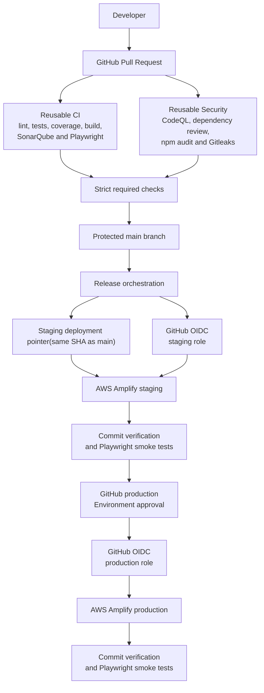

# FlightOps Secure Delivery Factory

[](https://github.com/DDongZheng/flightops-secure-delivery/actions/workflows/release.yml)
[](https://github.com/DDongZheng/flightops-secure-delivery/actions/workflows/reusable-security.yml)
[](https://github.com/DDongZheng/flightops-secure-delivery/actions/workflows/smoke-test.yml)
[](https://sonarcloud.io/summary/overall?id=DDongZheng_flightops-secure-delivery)
[](https://sonarcloud.io/summary/overall?id=DDongZheng_flightops-secure-delivery)
[](https://sonarcloud.io/summary/overall?id=DDongZheng_flightops-secure-delivery)

A small-scale DevSecOps delivery factory built around a simulated flight-readiness application.

The project demonstrates how reusable GitHub Actions workflows can enforce software quality, application security and controlled promotion through staging and production while AWS Amplify provides the hosting and AWS-specific deployment target.

## Live environments

- [Production — Flight Readiness Dashboard](https://main.d2lh4ktwzmstsc.amplifyapp.com/)
- [Staging](https://staging.d2lh4ktwzmstsc.amplifyapp.com/)

> [!IMPORTANT]
> The application uses fictional demonstration data only. It does not contain real flight, aircraft, passenger or operational information and must not be used to make real operational decisions.

New missions are stored only in browser memory. Refreshing the page restores the original demonstration data.

## What this project demonstrates

- reusable CI and security workflows;
- protected pull request delivery;
- automated linting, tests, coverage and production builds;
- SonarQube Quality Gates;
- CodeQL static application security testing;
- dependency review and vulnerability auditing;
- secret scanning with Gitleaks;
- Playwright end-to-end and post-deployment testing;
- fixed staging-to-production promotion;
- GitHub Environments and production approval;
- GitHub OIDC authentication to AWS;
- separate least-privilege staging and production roles;
- explicit Amplify deployment and deployed-commit verification;
- scheduled production availability checks;
- documented SSDLC, vulnerability management and delivery evidence.

## Architecture



## Pull request pipeline

Every pull request targeting `main` invokes the reusable CI and security workflows.

```text
Pull Request
  → npm ci
  → ESLint
  → Vitest unit and component tests
  → 80% coverage thresholds
  → Production build
  → SonarQube Quality Gate
  → Playwright end-to-end tests
  → CodeQL
  → Dependency Review
  → npm audit
  → Gitleaks
  → Required checks allow merge
```

The active `main` Ruleset requires pull requests, resolved review conversations and six strict status checks against the latest target branch.

The project currently relies on automated required checks and does not require an approving pull request review. This is documented as a personal-project governance limitation.

## Release pipeline

A change merged into `main` triggers the Release workflow.

```text
main
  → Reusable CI and Security
  → Promote the same commit to staging
  → Assume the staging AWS role through GitHub OIDC
  → Start the Amplify staging deployment
  → Wait for a successful terminal state
  → Verify the deployed commit ID
  → Run staging Playwright tests
  → Wait for production Environment approval
  → Assume the production AWS role through GitHub OIDC
  → Start the Amplify production deployment
  → Wait for a successful terminal state
  → Verify the deployed commit ID
  → Run production Playwright tests
```

Amplify Auto-build is disabled for both `staging` and `main`. GitHub Actions explicitly orchestrates each deployment.

The workflow rejects a release if the staging branch or an Amplify deployment does not match the GitHub release commit.

## Security controls

| Area | Control |
| --- | --- |
| Source governance | Protected `main`, pull requests and strict required checks |
| Code quality | ESLint and SonarQube Quality Gate |
| Automated testing | Vitest, React Testing Library and Playwright |
| Coverage | 80% minimum for statements, branches, functions and lines |
| Static security analysis | CodeQL for JavaScript and TypeScript |
| Dependency security | Dependency Review, `npm audit` and Dependabot |
| Secret detection | Gitleaks |
| Build reproducibility | Committed lockfile and `npm ci` |
| Cloud authentication | GitHub OIDC with temporary AWS credentials |
| Deployment permissions | Separate least-privilege staging and production roles |
| Production authorization | GitHub `production` Environment with a required reviewer |
| Release integrity | Staging SHA and Amplify `commitId` verification |
| Runtime verification | Post-deployment Playwright and scheduled smoke tests |

The secure development policy supports practices associated with ISO 27001, but this project does not claim ISO 27001 certification.

## Verified quality results

The latest documented verification recorded:

| Metric | Result |
| --- | ---: |
| Unit and component test files | 3 passed |
| Unit and component tests | 17 passed |
| CI Playwright tests | 2 passed |
| Staging Playwright tests | 2 passed |
| Production Playwright tests | 2 passed |
| Statements coverage | 93.65% |
| Branch coverage | 93.10% |
| Functions coverage | 100% |
| Lines coverage | 93.44% |

See [Delivery Evidence](DELIVERY_EVIDENCE.md) for traceable pull requests, workflow runs, deployment results, artifacts and documented limitations.

## Application features

The Flight Readiness Dashboard allows a user to:

- view simulated flight missions;
- distinguish Draft, Ready and Blocked missions;
- create a new flight mission;
- complete a readiness checklist;
- report a technical issue;
- calculate mission readiness automatically.

Readiness is calculated using the following rules:

```text
Mission not submitted
  → DRAFT

Mission submitted with an incomplete checklist
  → BLOCKED

Mission submitted with a technical issue
  → BLOCKED

Mission submitted with all checks completed
  → READY
```

## Documentation

- [Delivery Evidence](DELIVERY_EVIDENCE.md)
- [Secure Development Policy — English](SECURE_DEVELOPMENT_POLICY.md)
- [Politique de développement sécurisé — Français](SECURE_DEVELOPMENT_POLICY.fr.md)
- [安全开发政策 — 中文](SECURE_DEVELOPMENT_POLICY.zh-CN.md)

## Local development

### Prerequisites

- Node.js 24
- npm

The project declares the supported runtime as Node.js `>=24 <25`.

### Install dependencies

```bash
npm ci
```

### Start the development server

```bash
npm run dev
```

### Run quality and test controls

```bash
npm run lint
npm run test
npm run test:coverage
npm run build
npx playwright install chromium
npm run test:e2e
```

### Preview the production build

```bash
npm run preview
```

## Project structure

```text
.
├── .github/
│   ├── dependabot.yml
│   └── workflows/
│       ├── pull-request.yml
│       ├── release.yml
│       ├── reusable-ci.yml
│       ├── reusable-security.yml
│       └── smoke-test.yml
├── e2e/
│   └── flight-readiness.spec.ts
├── src/
│   ├── components/
│   ├── data/
│   ├── domain/
│   ├── test/
│   ├── types/
│   └── App.tsx
├── amplify.yml
├── DELIVERY_EVIDENCE.md
├── SECURE_DEVELOPMENT_POLICY.md
├── SECURE_DEVELOPMENT_POLICY.fr.md
├── SECURE_DEVELOPMENT_POLICY.zh-CN.md
├── playwright.config.ts
├── sonar-project.properties
└── vitest.config.ts
```

## Technology stack

### Application

- React
- TypeScript
- Vite
- HTML and CSS

### Testing and quality

- Vitest
- React Testing Library
- jsdom
- Playwright
- V8 Coverage
- SonarQube Cloud
- ESLint

### Security

- CodeQL
- Dependency Review
- npm audit
- Dependabot
- Gitleaks
- GitHub OIDC

### Delivery and hosting

- GitHub Actions
- GitHub Rulesets
- GitHub Environments
- AWS IAM
- AWS Amplify Hosting

## Known limitations

- This is a personal project with no independent separation of duties.
- Pull requests currently require automated checks but not an approving review.
- The production reviewer may approve their own deployment.
- Workflow artifacts are retained for seven days.
- Third-party Actions use version tags rather than immutable commit SHAs.
- Monitoring is limited to workflow results, Amplify records and scheduled smoke tests.
- Automated production rollback is not implemented.
- The application is public, unauthenticated and intentionally has no persistent data.

## Project scope

This repository is intended for learning and portfolio demonstration. It shows a secure delivery approach for a small frontend application; it is not a certified or production flight-operations platform.
